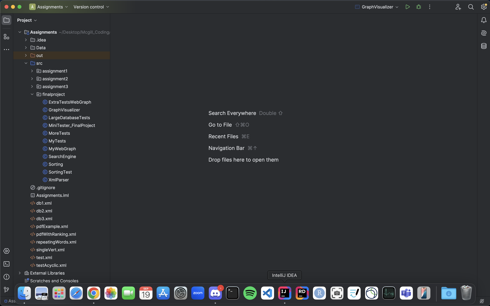

# Search Engine Project

This project simulates a simple search engine. It explores a subset of the web (simulated through a database), builds an index for the words in each web page, analyzes the structure of the web graph to rank web pages, and allows users to search for relevant pages based on a query.

## Features

1. **Web Exploration**: Simulates a portion of the web using a database containing multiple web pages.
2. **Word Indexing**: Indexes words found in each web page for efficient searching and retrieval.
3. **Web Graph Analysis**: Analyzes the web structure using link analysis to determine which pages are more important.
4. **Search Functionality**: Users can input a search query, and the engine will return a sorted list of relevant pages based on the indexed content and graph structure.

## How It Works

- The project uses a predefined set of web pages stored in a database to simulate the web.
- The indexing module processes each page to create a searchable index of words.
- A web graph is constructed where nodes represent pages, and edges represent links between pages.
- The search engine ranks pages using a combination of keyword relevance and page importance derived from the web graph.
- When a query is entered, the engine returns a list of relevant web pages, sorted by their rank.

## Installation

To run this project locally, mostly used IntelliJ IDEA:

Arrange the files like shown below:

